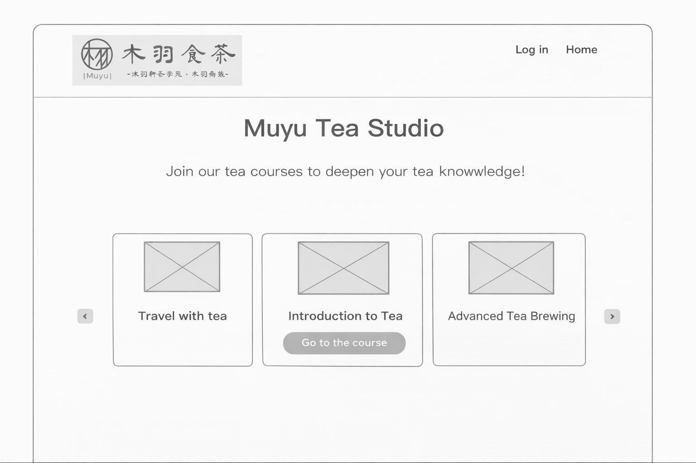
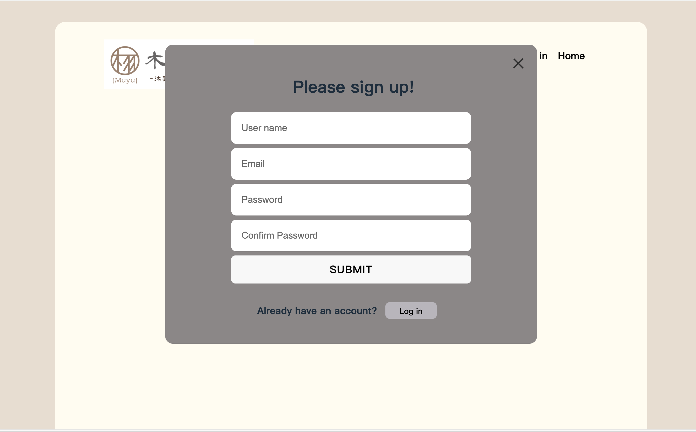

 # Muyu Tea - Online Tea Course Platform
  A full-stack web application for browsing and enrolling in tea courses, built with the PERN stack (PostgreSQL, Express, React, Node.js). 
  
  **Live Demo:** http://54.205.53.207

  ## Key Features

  - **User Authentication**: Secure registration and login system with JWT tokens and bcrypt password hashing
  - **Course Management**: Browse tea courses with detailed information, pricing, and images
  - **Responsive Design**: Modern UI with smooth animations and mobile-friendly layout
  - **Carousel Display**: Interactive course preview with navigation controls

  ## Key Learnings
  - **Planning UI/UX**
  - **Full-stack Development**: Connected frontend, backend, and database
  - **Database Design**: PostgreSQL (users, courses, enrollments)
  - **REST API** 
  - **JWT-based  Authentication & password hashing**
  - **Cloud Deployment**: AWS EC2 setup, Nginx configuration, PM2 process management

  ## Technologies

  ### Frontend
  - **React** 18.3.1
  - **TypeScript** 5.6.2
  - **Vite** 6.0.11

  ### Backend
  - **Node.js** 20.x
  - **Express** 4.21.2
  - **TypeScript** 5.7.3
  - **PostgreSQL** 16

 ### User Flow
 
 ### Wireframing
  
  
 ### Home Page                                                                           
 
 
 ### Register Page                                                                             

 ### Course Detail Page                                                                             

 
